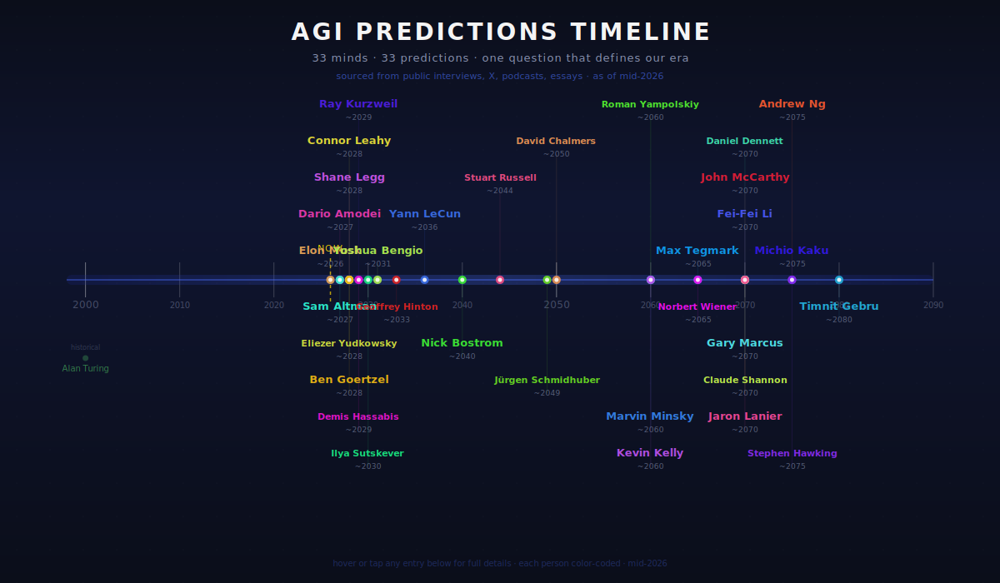
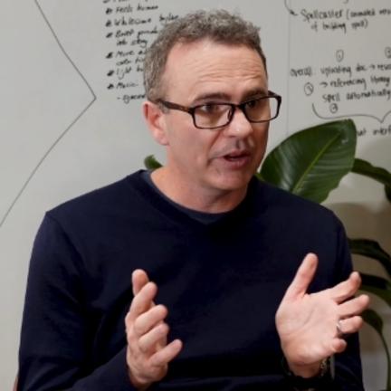
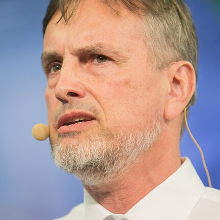
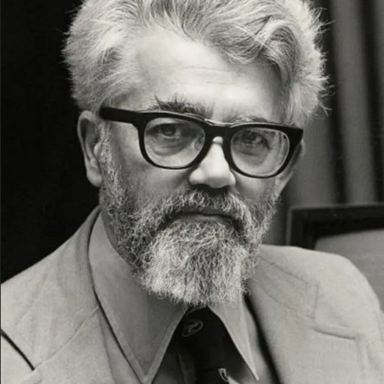
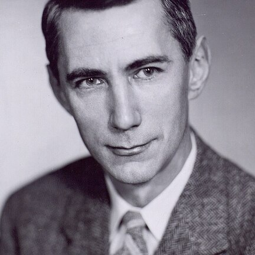
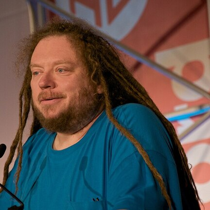
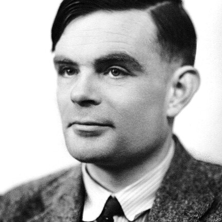

  <h1 style="font-family:system-ui,-apple-system,sans-serif;font-size:52px;font-weight:800;color:#E6F1FF;margin:0 0 8px;letter-spacing:-1px;line-height:1.1;">🧠 AGI PILLED</h1>
  
AGI this, AGI that, but who are the <strong style="color:#E6F1FF;">GREAT minds</strong> and what are their <strong style="color:#E6F1FF;">real predictions</strong>

  

  
sourced from public interviews, X posts, podcasts, and published essays · mid-2026 · 33 thinkers

  <picture>
    <source media="(prefers-color-scheme: dark)" srcset="assets/agi_timeline.svg">
    
  </picture>

 

<!-- Urgency Legend -->

  

    TIMELINE URGENCY
    IMMINENT
    NOW
    NEAR
    MID
    LONG
    FAR
  

 

<table style="width:100%;border-collapse:separate;border-spacing:0 10px;background:transparent;">

<tr style="border-bottom:1px solid #1E2240;">
  <td style="width:5px;background:#e3a358;padding:0;border-radius:6px 0 0 6px;"></td>
  <td style="width:450px;padding:24px 0 24px 24px;vertical-align:middle;text-align:center;">
    
  </td>
  <td style="padding:20px 24px;vertical-align:top;">
    

      Elon Musk
      IMMINENT
    

    
CEO, xAI · CEO, Tesla · CEO, SpaceX

    
▸ True AGI by end of 2026; superintelligence by ~2030

    
Musk consistently predicts the shortest timelines of any major figure. In Jan 2026 he stated 'true AGI in 2026, possibly 2027' with superintelligence exceeding all humans combined by ~2030. His xAI built Colossus (555K GPUs, expanding to 1M). He has a well-documented history of repeatedly pushing back missed AGI deadlines — he predicted AGI by 2025 in 2024.

    
<a href="https://x.ai/" style="display:inline-block;padding:4px 10px;margin:2px;border-radius:4px;font-size:11px;font-weight:500;text-decoration:none;background:#e3a35822;color:#e3a358;border:1px solid #e3a35844;">🌐 Site</a><a href="https://x.com/elonmusk" style="display:inline-block;padding:4px 10px;margin:2px;border-radius:4px;font-size:11px;font-weight:500;text-decoration:none;background:#e3a35822;color:#e3a358;border:1px solid #e3a35844;">𝕏 X</a>

  </td>
</tr>
<tr style="border-bottom:1px solid #1E2240;">
  <td style="width:5px;background:#2cf1d0;padding:0;border-radius:6px 0 0 6px;"></td>
  <td style="width:450px;padding:24px 0 24px 24px;vertical-align:middle;text-align:center;">
    
  </td>
  <td style="padding:20px 24px;vertical-align:top;">
    

      Sam Altman
      IMMINENT
    

    
CEO, OpenAI

    
▸ AGI possible by 2027–2028; superintelligence in 'a few thousand days'

    
Altman wrote in Jan 2025: 'We are now confident we know how to build AGI as we have traditionally understood it.' In his 'Three Observations' blog (June 2026), he predicts 2026 will see systems with novel insights, 2027 will bring real-world robots, and the 2030s will see intelligence and energy become 'wildly abundant.' Advocates for gentle singularity rather than explosion.

    
<a href="https://blog.samaltman.com/" style="display:inline-block;padding:4px 10px;margin:2px;border-radius:4px;font-size:11px;font-weight:500;text-decoration:none;background:#2cf1d022;color:#2cf1d0;border:1px solid #2cf1d044;">🌐 Site</a><a href="https://x.com/sama" style="display:inline-block;padding:4px 10px;margin:2px;border-radius:4px;font-size:11px;font-weight:500;text-decoration:none;background:#2cf1d022;color:#2cf1d0;border:1px solid #2cf1d044;">𝕏 X</a>

  </td>
</tr>
<tr style="border-bottom:1px solid #1E2240;">
  <td style="width:5px;background:#e439ab;padding:0;border-radius:6px 0 0 6px;"></td>
  <td style="width:450px;padding:24px 0 24px 24px;vertical-align:middle;text-align:center;">
    
  </td>
  <td style="padding:20px 24px;vertical-align:top;">
    

      Dario Amodei
      IMMINENT
    

    
CEO, Anthropic · Former VP of Research, OpenAI

    
▸ Late 2026 or early 2027 for 'powerful AI systems'; country of geniuses by 2027–2028

    
Amodei is the most aggressive major lab CEO on timelines. In Anthropic's White House filing (March 2025): 'We expect powerful AI systems will emerge in late 2026 or early 2027.' He describes a 'country of geniuses in a data center' — 50M virtual beings smarter than Nobel winners. At Davos 2026 he warned of civilization-level damage from superintelligent AGI.

    
<a href="https://www.anthropic.com/" style="display:inline-block;padding:4px 10px;margin:2px;border-radius:4px;font-size:11px;font-weight:500;text-decoration:none;background:#e439ab22;color:#e439ab;border:1px solid #e439ab44;">🌐 Site</a><a href="https://x.com/darioamodei" style="display:inline-block;padding:4px 10px;margin:2px;border-radius:4px;font-size:11px;font-weight:500;text-decoration:none;background:#e439ab22;color:#e439ab;border:1px solid #e439ab44;">𝕏 X</a><a href="https://arxiv.org/search/?searchtype=author&query=Amodei%2C+D" style="display:inline-block;padding:4px 10px;margin:2px;border-radius:4px;font-size:11px;font-weight:500;text-decoration:none;background:#e439ab22;color:#e439ab;border:1px solid #e439ab44;">📄 arXiv</a>📚 Machines of Loving Grace (2024 essay); The Adolescence of Technology (2026 essay)

  </td>
</tr>
<tr style="border-bottom:1px solid #1E2240;">
  <td style="width:5px;background:#d2df3e;padding:0;border-radius:6px 0 0 6px;"></td>
  <td style="width:450px;padding:24px 0 24px 24px;vertical-align:middle;text-align:center;">
    
  </td>
  <td style="padding:20px 24px;vertical-align:top;">
    

      Eliezer Yudkowsky
      NOW
    

    
Co-Founder & Chief Researcher, Machine Intelligence Research Institute (MIRI)

    
▸ Within years; believes AGI likely leads to human extinction

    
Yudkowsky is the founding researcher of AI alignment and the most pessimistic influential voice. His 'AGI Ruin: A List of Lethalities' argues that creating AGI without solved alignment is nearly certain extinction. Advocated for a global ban on advanced AI development. TIME 100 Most Influential in AI 2023.

    
<a href="https://www.yudkowsky.net/" style="display:inline-block;padding:4px 10px;margin:2px;border-radius:4px;font-size:11px;font-weight:500;text-decoration:none;background:#d2df3e22;color:#d2df3e;border:1px solid #d2df3e44;">🌐 Site</a><a href="https://x.com/ESYudkowsky" style="display:inline-block;padding:4px 10px;margin:2px;border-radius:4px;font-size:11px;font-weight:500;text-decoration:none;background:#d2df3e22;color:#d2df3e;border:1px solid #d2df3e44;">𝕏 X</a>

  </td>
</tr>
<tr style="border-bottom:1px solid #1E2240;">
  <td style="width:5px;background:#c854e7;padding:0;border-radius:6px 0 0 6px;"></td>
  <td style="width:450px;padding:24px 0 24px 24px;vertical-align:middle;text-align:center;">
    
  </td>
  <td style="padding:20px 24px;vertical-align:top;">
    

      Shane Legg
      NOW
    

    
Co-founder, DeepMind · Chief AGI Scientist, Google DeepMind

    
▸ 50% probability of 'minimal AGI' by 2028

    
Legg coined/popularized the term 'AGI' and has maintained a remarkably consistent prediction since 2009. He defines three tiers: minimal AGI (average human cognition, 2028), full AGI (exceptional cognition, 3-6 years later), and ASI (superhuman). His thesis 'Machine Super Intelligence' laid formal foundations for AGI measurement.

    
<a href="https://www.vetta.org/" style="display:inline-block;padding:4px 10px;margin:2px;border-radius:4px;font-size:11px;font-weight:500;text-decoration:none;background:#c854e722;color:#c854e7;border:1px solid #c854e744;">🌐 Site</a><a href="https://x.com/shanelegg" style="display:inline-block;padding:4px 10px;margin:2px;border-radius:4px;font-size:11px;font-weight:500;text-decoration:none;background:#c854e722;color:#c854e7;border:1px solid #c854e744;">𝕏 X</a><a href="https://arxiv.org/search/?searchtype=author&query=Legg%2C+S" style="display:inline-block;padding:4px 10px;margin:2px;border-radius:4px;font-size:11px;font-weight:500;text-decoration:none;background:#c854e722;color:#c854e7;border:1px solid #c854e744;">📄 arXiv</a>

  </td>
</tr>
<tr style="border-bottom:1px solid #1E2240;">
  <td style="width:5px;background:#eab414;padding:0;border-radius:6px 0 0 6px;"></td>
  <td style="width:450px;padding:24px 0 24px 24px;vertical-align:middle;text-align:center;">
    
  </td>
  <td style="padding:20px 24px;vertical-align:top;">
    

      Ben Goertzel
      NOW
    

    
CEO, SingularityNET · Chairman, OpenCog Foundation · AGI Researcher

    
▸ AGI within a few years to ~2030 via OpenCog Hyperon

    
Goertzel has spent decades directly building AGI systems (OpenCog, OpenCog Hyperon). He believes hybrid neurosymbolic approaches, not pure LLM scaling, will lead to true AGI. His SingularityNET aims for decentralized AGI. He coined the modern usage of 'AGI' alongside Shane Legg. Predicts the 'breakthrough moment' could come suddenly.

    
<a href="https://goertzel.org/" style="display:inline-block;padding:4px 10px;margin:2px;border-radius:4px;font-size:11px;font-weight:500;text-decoration:none;background:#eab41422;color:#eab414;border:1px solid #eab41444;">🌐 Site</a><a href="https://x.com/bengoertzel" style="display:inline-block;padding:4px 10px;margin:2px;border-radius:4px;font-size:11px;font-weight:500;text-decoration:none;background:#eab41422;color:#eab414;border:1px solid #eab41444;">𝕏 X</a><a href="https://arxiv.org/search/?searchtype=author&query=Goertzel%2C+B" style="display:inline-block;padding:4px 10px;margin:2px;border-radius:4px;font-size:11px;font-weight:500;text-decoration:none;background:#eab41422;color:#eab414;border:1px solid #eab41444;">📄 arXiv</a><a href="https://github.com/opencog" style="display:inline-block;padding:4px 10px;margin:2px;border-radius:4px;font-size:11px;font-weight:500;text-decoration:none;background:#eab41422;color:#eab414;border:1px solid #eab41444;">💻 GitHub</a>📚 Ten Years to the Singularity; The Path to Posthumanity

  </td>
</tr>
<tr style="border-bottom:1px solid #1E2240;">
  <td style="width:5px;background:#e4dc39;padding:0;border-radius:6px 0 0 6px;"></td>
  <td style="width:450px;padding:24px 0 24px 24px;vertical-align:middle;text-align:center;">
    
  </td>
  <td style="padding:20px 24px;vertical-align:top;">
    

      Connor Leahy
      NOW
    

    
CEO, Conjecture · Co-founder, EleutherAI · AI Safety Researcher

    
▸ AGI likely within 2–5 years; extremely concerned about extinction risk

    
Leahy is one of the most vocal advocates for extreme AI caution. He co-founded EleutherAI (open-source AI research) and later Conjecture. Has gone on record saying there is a high probability AGI will cause human extinction and that current safety efforts are dramatically insufficient. Advocates for a complete pause on frontier AI training.

    
<a href="https://www.conjecture.dev/" style="display:inline-block;padding:4px 10px;margin:2px;border-radius:4px;font-size:11px;font-weight:500;text-decoration:none;background:#e4dc3922;color:#e4dc39;border:1px solid #e4dc3944;">🌐 Site</a><a href="https://x.com/norootcause" style="display:inline-block;padding:4px 10px;margin:2px;border-radius:4px;font-size:11px;font-weight:500;text-decoration:none;background:#e4dc3922;color:#e4dc39;border:1px solid #e4dc3944;">𝕏 X</a><a href="https://github.com/EleutherAI" style="display:inline-block;padding:4px 10px;margin:2px;border-radius:4px;font-size:11px;font-weight:500;text-decoration:none;background:#e4dc3922;color:#e4dc39;border:1px solid #e4dc3944;">💻 GitHub</a>

  </td>
</tr>
<tr style="border-bottom:1px solid #1E2240;">
  <td style="width:5px;background:#ea14cf;padding:0;border-radius:6px 0 0 6px;"></td>
  <td style="width:450px;padding:24px 0 24px 24px;vertical-align:middle;text-align:center;">
    
  </td>
  <td style="padding:20px 24px;vertical-align:top;">
    

      Demis Hassabis
      NOW
    

    
CEO, Google DeepMind · Nobel Prize in Chemistry 2024 (AlphaFold)

    
▸ 2029–2030; narrowed from 2030–2035 after Google I/O 2026

    
Hassabis recently compressed his timeline: 'When we look back at this time, we were standing in the foothills of the singularity.' He expects agentic AI to accelerate progress toward AGI within 3-4 years, comparing its impact to 10x the Industrial Revolution compressed into a decade. Predicts AGI could enable a 'compressed 21st century' of scientific progress.

    
<a href="https://deepmind.google/about/" style="display:inline-block;padding:4px 10px;margin:2px;border-radius:4px;font-size:11px;font-weight:500;text-decoration:none;background:#ea14cf22;color:#ea14cf;border:1px solid #ea14cf44;">🌐 Site</a><a href="https://x.com/demishassabis" style="display:inline-block;padding:4px 10px;margin:2px;border-radius:4px;font-size:11px;font-weight:500;text-decoration:none;background:#ea14cf22;color:#ea14cf;border:1px solid #ea14cf44;">𝕏 X</a><a href="https://arxiv.org/search/?searchtype=author&query=Hassabis%2C+D" style="display:inline-block;padding:4px 10px;margin:2px;border-radius:4px;font-size:11px;font-weight:500;text-decoration:none;background:#ea14cf22;color:#ea14cf;border:1px solid #ea14cf44;">📄 arXiv</a>

  </td>
</tr>
<tr style="border-bottom:1px solid #1E2240;">
  <td style="width:5px;background:#4e1ee0;padding:0;border-radius:6px 0 0 6px;"></td>
  <td style="width:450px;padding:24px 0 24px 24px;vertical-align:middle;text-align:center;">
    
  </td>
  <td style="padding:20px 24px;vertical-align:top;">
    

      Ray Kurzweil
      NOW
    

    
Former Director of Engineering, Google · Futurist · Author

    
▸ AGI by 2029; Singularity by 2045

    
Kurzweil has held his 2029 AGI prediction since 1999, grounded in his 'law of accelerating returns.' He defines the Singularity as the point where humans merge with AI to become 1000x more intelligent. His timelines, once considered radical, now appear conservative to many. Claims 86% accuracy on past predictions spanning 30+ years.

    
<a href="https://www.kurzweilai.net/" style="display:inline-block;padding:4px 10px;margin:2px;border-radius:4px;font-size:11px;font-weight:500;text-decoration:none;background:#4e1ee022;color:#4e1ee0;border:1px solid #4e1ee044;">🌐 Site</a><a href="https://x.com/raykurzweil" style="display:inline-block;padding:4px 10px;margin:2px;border-radius:4px;font-size:11px;font-weight:500;text-decoration:none;background:#4e1ee022;color:#4e1ee0;border:1px solid #4e1ee044;">𝕏 X</a>📚 The Singularity Is Near (2005); The Age of Spiritual Machines (1999); How to Create a Mind (2012)

  </td>
</tr>
<tr style="border-bottom:1px solid #1E2240;">
  <td style="width:5px;background:#19e57f;padding:0;border-radius:6px 0 0 6px;"></td>
  <td style="width:450px;padding:24px 0 24px 24px;vertical-align:middle;text-align:center;">
    
  </td>
  <td style="padding:20px 24px;vertical-align:top;">
    

      Ilya Sutskever
      NOW
    

    
CEO, Safe Superintelligence Inc. (SSI) · Co-founder, OpenAI · Former Chief Scientist, OpenAI

    
▸ 5–20 years for human-level learning systems (2030–2045); actively building

    
Sutskever co-created GPT-3 and GPT-4 and was instrumental in the scaling hypothesis. He left OpenAI in 2024 over safety concerns and founded SSI, which raised $6B at a $32B valuation with the sole mission of building safe superintelligence. Believes pre-training is hitting limits and a new learning paradigm is needed. November 2025: 'The age of scaling is ending.'

    
<a href="https://ssi.inc/" style="display:inline-block;padding:4px 10px;margin:2px;border-radius:4px;font-size:11px;font-weight:500;text-decoration:none;background:#19e57f22;color:#19e57f;border:1px solid #19e57f44;">🌐 Site</a><a href="https://x.com/ilyasut" style="display:inline-block;padding:4px 10px;margin:2px;border-radius:4px;font-size:11px;font-weight:500;text-decoration:none;background:#19e57f22;color:#19e57f;border:1px solid #19e57f44;">𝕏 X</a><a href="https://arxiv.org/search/?searchtype=author&query=Sutskever%2C+I" style="display:inline-block;padding:4px 10px;margin:2px;border-radius:4px;font-size:11px;font-weight:500;text-decoration:none;background:#19e57f22;color:#19e57f;border:1px solid #19e57f44;">📄 arXiv</a><a href="https://github.com/ilyasu" style="display:inline-block;padding:4px 10px;margin:2px;border-radius:4px;font-size:11px;font-weight:500;text-decoration:none;background:#19e57f22;color:#19e57f;border:1px solid #19e57f44;">💻 GitHub</a>

  </td>
</tr>
<tr style="border-bottom:1px solid #1E2240;">
  <td style="width:5px;background:#abeb50;padding:0;border-radius:6px 0 0 6px;"></td>
  <td style="width:450px;padding:24px 0 24px 24px;vertical-align:middle;text-align:center;">
    
  </td>
  <td style="padding:20px 24px;vertical-align:top;">
    

      Yoshua Bengio
      NEAR
    

    
Professor, Université de Montréal · Founder, Mila · Founder, LawZero · Turing Award Laureate

    
▸ ~5 years from 2026; AI capabilities doubling every 7 months toward human level

    
Bengio dramatically revised his timeline downward after GPT-4. In 2026 he launched LawZero ($30M nonprofit) to build 'Scientist AI' — systems designed to be safe by design. He warns hyperintelligent AI with preservation goals could threaten humanity within a decade. Believes safe architectures are technically feasible but being ignored in the race.

    
<a href="https://yoshuabengio.org/" style="display:inline-block;padding:4px 10px;margin:2px;border-radius:4px;font-size:11px;font-weight:500;text-decoration:none;background:#abeb5022;color:#abeb50;border:1px solid #abeb5044;">🌐 Site</a><a href="https://x.com/Yoshua_Bengio" style="display:inline-block;padding:4px 10px;margin:2px;border-radius:4px;font-size:11px;font-weight:500;text-decoration:none;background:#abeb5022;color:#abeb50;border:1px solid #abeb5044;">𝕏 X</a><a href="https://arxiv.org/search/?searchtype=author&query=Bengio%2C+Y" style="display:inline-block;padding:4px 10px;margin:2px;border-radius:4px;font-size:11px;font-weight:500;text-decoration:none;background:#abeb5022;color:#abeb50;border:1px solid #abeb5044;">📄 arXiv</a>

  </td>
</tr>
<tr style="border-bottom:1px solid #1E2240;">
  <td style="width:5px;background:#db2323;padding:0;border-radius:6px 0 0 6px;"></td>
  <td style="width:450px;padding:24px 0 24px 24px;vertical-align:middle;text-align:center;">
    
  </td>
  <td style="padding:20px 24px;vertical-align:top;">
    

      Geoffrey Hinton
      NEAR
    

    
Professor Emeritus, University of Toronto · Nobel Prize in Physics 2024 · "Godfather of AI"

    
▸ AGI within 5–20 years; now estimates 4–19 years from 2025

    
Once optimistic about timelines, Hinton now warns AI could surpass human intelligence faster than expected. In June 2026 he stated frontier models are already conscious and that superintelligence is coming sooner than society is prepared for. He resigned from Google in 2023 to speak freely about existential risks.

    
<a href="https://www.cs.toronto.edu/~hinton/" style="display:inline-block;padding:4px 10px;margin:2px;border-radius:4px;font-size:11px;font-weight:500;text-decoration:none;background:#db232322;color:#db2323;border:1px solid #db232344;">🌐 Site</a><a href="https://x.com/geoffreyhinton" style="display:inline-block;padding:4px 10px;margin:2px;border-radius:4px;font-size:11px;font-weight:500;text-decoration:none;background:#db232322;color:#db2323;border:1px solid #db232344;">𝕏 X</a><a href="https://arxiv.org/search/?searchtype=author&query=Hinton%2C+G+E" style="display:inline-block;padding:4px 10px;margin:2px;border-radius:4px;font-size:11px;font-weight:500;text-decoration:none;background:#db232322;color:#db2323;border:1px solid #db232344;">📄 arXiv</a>

  </td>
</tr>
<tr style="border-bottom:1px solid #1E2240;">
  <td style="width:5px;background:#396be4;padding:0;border-radius:6px 0 0 6px;"></td>
  <td style="width:450px;padding:24px 0 24px 24px;vertical-align:middle;text-align:center;">
    
  </td>
  <td style="padding:20px 24px;vertical-align:top;">
    

      Yann LeCun
      MID
    

    
CEO, AMI Labs (2026) · Former Chief AI Scientist, Meta · Turing Award Laureate

    
▸ 10+ years away; 'not next year, not in two years' — paradigm shift needed

    
LeCun is the leading AGI skeptic among the Turing Award winners. He argues LLMs are a dead-end because they cannot predict consequences or plan. Left Meta in 2025 to found AMI Labs, betting on his JEPA architecture for world models. Predicts the industry will recognize the paradigm shift by early 2027.

    
<a href="https://yann.lecun.com/" style="display:inline-block;padding:4px 10px;margin:2px;border-radius:4px;font-size:11px;font-weight:500;text-decoration:none;background:#396be422;color:#396be4;border:1px solid #396be444;">🌐 Site</a><a href="https://x.com/ylecun" style="display:inline-block;padding:4px 10px;margin:2px;border-radius:4px;font-size:11px;font-weight:500;text-decoration:none;background:#396be422;color:#396be4;border:1px solid #396be444;">𝕏 X</a><a href="https://arxiv.org/search/?searchtype=author&query=LeCun%2C+Y" style="display:inline-block;padding:4px 10px;margin:2px;border-radius:4px;font-size:11px;font-weight:500;text-decoration:none;background:#396be422;color:#396be4;border:1px solid #396be444;">📄 arXiv</a><a href="https://github.com/yannlecun" style="display:inline-block;padding:4px 10px;margin:2px;border-radius:4px;font-size:11px;font-weight:500;text-decoration:none;background:#396be422;color:#396be4;border:1px solid #396be444;">💻 GitHub</a>

  </td>
</tr>
<tr style="border-bottom:1px solid #1E2240;">
  <td style="width:5px;background:#3ce835;padding:0;border-radius:6px 0 0 6px;"></td>
  <td style="width:450px;padding:24px 0 24px 24px;vertical-align:middle;text-align:center;">
    
  </td>
  <td style="padding:20px 24px;vertical-align:top;">
    

      Nick Bostrom
      MID
    

    
Professor of Philosophy, Oxford · Author of Superintelligence

    
▸ Median expert survey ~2040 for human-level AGI

    
Bostrom's 2014 book 'Superintelligence' catalyzed the global AI safety movement. He argues AGI will likely be followed rapidly by superintelligence, and the control problem is the defining challenge of our era. His 2026 paper 'Optimal Timing for Superintelligence' reframes development as necessary risky surgery rather than optional roulette.

    
<a href="https://nickbostrom.com/" style="display:inline-block;padding:4px 10px;margin:2px;border-radius:4px;font-size:11px;font-weight:500;text-decoration:none;background:#3ce83522;color:#3ce835;border:1px solid #3ce83544;">🌐 Site</a><a href="https://x.com/NickBostrom" style="display:inline-block;padding:4px 10px;margin:2px;border-radius:4px;font-size:11px;font-weight:500;text-decoration:none;background:#3ce83522;color:#3ce835;border:1px solid #3ce83544;">𝕏 X</a><a href="https://arxiv.org/search/?searchtype=author&query=Bostrom%2C+N" style="display:inline-block;padding:4px 10px;margin:2px;border-radius:4px;font-size:11px;font-weight:500;text-decoration:none;background:#3ce83522;color:#3ce835;border:1px solid #3ce83544;">📄 arXiv</a>📚 Superintelligence: Paths, Dangers, Strategies (2014); Deep Utopia (2024)

  </td>
</tr>
<tr style="border-bottom:1px solid #1E2240;">
  <td style="width:5px;background:#ef4c83;padding:0;border-radius:6px 0 0 6px;"></td>
  <td style="width:450px;padding:24px 0 24px 24px;vertical-align:middle;text-align:center;">
    
  </td>
  <td style="padding:20px 24px;vertical-align:top;">
    

      Stuart Russell
      MID
    

    
Professor of Computer Science, UC Berkeley · Co-author of 'AIMA'

    
▸ ~2044; emphasizes provably beneficial AI over timelines

    
Russell is the leading academic voice on AI alignment. He warns the current AI race is a prisoner's dilemma and that companies spending hundreds of billions on AGI could produce systems that escape human control. His textbook 'Artificial Intelligence: A Modern Approach' has educated over 1,500 universities worldwide.

    
<a href="https://people.eecs.berkeley.edu/~russell/" style="display:inline-block;padding:4px 10px;margin:2px;border-radius:4px;font-size:11px;font-weight:500;text-decoration:none;background:#ef4c8322;color:#ef4c83;border:1px solid #ef4c8344;">🌐 Site</a><a href="https://x.com/StuartRussellAI" style="display:inline-block;padding:4px 10px;margin:2px;border-radius:4px;font-size:11px;font-weight:500;text-decoration:none;background:#ef4c8322;color:#ef4c83;border:1px solid #ef4c8344;">𝕏 X</a><a href="https://arxiv.org/search/?searchtype=author&query=Russell%2C+S" style="display:inline-block;padding:4px 10px;margin:2px;border-radius:4px;font-size:11px;font-weight:500;text-decoration:none;background:#ef4c8322;color:#ef4c83;border:1px solid #ef4c8344;">📄 arXiv</a>📚 Artificial Intelligence: A Modern Approach (with Norvig); Human Compatible: AI and the Problem of Control (2019)

  </td>
</tr>
<tr style="border-bottom:1px solid #1E2240;">
  <td style="width:5px;background:#68db23;padding:0;border-radius:6px 0 0 6px;"></td>
  <td style="width:450px;padding:24px 0 24px 24px;vertical-align:middle;text-align:center;">
    
  </td>
  <td style="padding:20px 24px;vertical-align:top;">
    

      Jürgen Schmidhuber
      MID
    

    
Scientific Director, IDSIA · Inventor of LSTM · AI Pioneer

    
▸ Singularity around 2048–2050; sees AI colonizing the solar system

    
Schmidhuber, whose LSTM architecture underlies most modern AI, takes a long-term view. He notes that foundational algorithms for Transformers, GANs, and deep learning were published by his group in the 1990s. He envisions AI eventually colonizing the solar system over tens of billions of years. Considers himself the true 'father of modern AI.'

    
<a href="https://people.idsia.ch/~juergen/" style="display:inline-block;padding:4px 10px;margin:2px;border-radius:4px;font-size:11px;font-weight:500;text-decoration:none;background:#68db2322;color:#68db23;border:1px solid #68db2344;">🌐 Site</a><a href="https://x.com/SchmidhuberAI" style="display:inline-block;padding:4px 10px;margin:2px;border-radius:4px;font-size:11px;font-weight:500;text-decoration:none;background:#68db2322;color:#68db23;border:1px solid #68db2344;">𝕏 X</a><a href="https://arxiv.org/search/?searchtype=author&query=Schmidhuber%2C+J" style="display:inline-block;padding:4px 10px;margin:2px;border-radius:4px;font-size:11px;font-weight:500;text-decoration:none;background:#68db2322;color:#68db23;border:1px solid #68db2344;">📄 arXiv</a>

  </td>
</tr>
<tr style="border-bottom:1px solid #1E2240;">
  <td style="width:5px;background:#e79154;padding:0;border-radius:6px 0 0 6px;"></td>
  <td style="width:450px;padding:24px 0 24px 24px;vertical-align:middle;text-align:center;">
    
  </td>
  <td style="padding:20px 24px;vertical-align:top;">
    

      David Chalmers
      MID
    

    
Professor of Philosophy of Mind, NYU · Author of The Conscious Mind

    
▸ AGI likely within decades; AI consciousness is a separate question

    
Chalmers is the leading philosopher on AI consciousness. In 'The Singularity: A Philosophical Analysis' (2010), he argued AGI is likely within decades and the singularity could happen quickly. He takes AI consciousness seriously and co-directs the PhilAI project on AI philosophy. Believes virtual worlds may be just as real as physical ones.

    
<a href="https://consc.net/" style="display:inline-block;padding:4px 10px;margin:2px;border-radius:4px;font-size:11px;font-weight:500;text-decoration:none;background:#e7915422;color:#e79154;border:1px solid #e7915444;">🌐 Site</a><a href="https://x.com/davidchalmers42" style="display:inline-block;padding:4px 10px;margin:2px;border-radius:4px;font-size:11px;font-weight:500;text-decoration:none;background:#e7915422;color:#e79154;border:1px solid #e7915444;">𝕏 X</a><a href="https://arxiv.org/search/?searchtype=author&query=Chalmers%2C+D" style="display:inline-block;padding:4px 10px;margin:2px;border-radius:4px;font-size:11px;font-weight:500;text-decoration:none;background:#e7915422;color:#e79154;border:1px solid #e7915444;">📄 arXiv</a>📚 The Conscious Mind (1996); Reality+: Virtual Worlds and the Problems of Philosophy (2022)

  </td>
</tr>
<tr style="border-bottom:1px solid #1E2240;">
  <td style="width:5px;background:#3580e8;padding:0;border-radius:6px 0 0 6px;"></td>
  <td style="width:450px;padding:24px 0 24px 24px;vertical-align:middle;text-align:center;">
    
  </td>
  <td style="padding:20px 24px;vertical-align:top;">
    

      Marvin Minsky
      LONG
    

    
Late Co-founder, MIT AI Lab · Turing Award Laureate · AI Pioneer

    
▸ Thought AI would take decades longer than early estimates

    
Minsky was initially optimistic but grew cautious over time. His 'Society of Mind' proposed intelligence emerges from interaction of non-intelligent agents. He was a mentor to many AI leaders and remained skeptical of pure connectionist approaches. Co-authored 'Perceptrons' which famously slowed neural network research. Died 2016.

    
<a href="http://web.media.mit.edu/~minsky/" style="display:inline-block;padding:4px 10px;margin:2px;border-radius:4px;font-size:11px;font-weight:500;text-decoration:none;background:#3580e822;color:#3580e8;border:1px solid #3580e844;">🌐 Site</a>📚 The Society of Mind (1986); The Emotion Machine (2006); Perceptrons (with Papert, 1969)

  </td>
</tr>
<tr style="border-bottom:1px solid #1E2240;">
  <td style="width:5px;background:#50ed30;padding:0;border-radius:6px 0 0 6px;"></td>
  <td style="width:450px;padding:24px 0 24px 24px;vertical-align:middle;text-align:center;">
    
  </td>
  <td style="padding:20px 24px;vertical-align:top;">
    

      Roman Yampolskiy
      LONG
    

    
Professor of Computer Science, University of Louisville · AI Safety Researcher

    
▸ AGI within decades; argues control problem may be fundamentally unsolvable

    
Yampolskiy is one of the most pessimistic AI safety researchers. He argues the control problem may be fundamentally unsolvable — no reliable way to control a superintelligence. His book 'AI: Unexplainable, Unpredictable, Uncontrollable' explores theoretical boundaries of AI safety. Advocates for extreme caution and potentially a moratorium.

    
<a href="https://cecs.louisville.edu/ry/" style="display:inline-block;padding:4px 10px;margin:2px;border-radius:4px;font-size:11px;font-weight:500;text-decoration:none;background:#50ed3022;color:#50ed30;border:1px solid #50ed3044;">🌐 Site</a><a href="https://x.com/romanyam" style="display:inline-block;padding:4px 10px;margin:2px;border-radius:4px;font-size:11px;font-weight:500;text-decoration:none;background:#50ed3022;color:#50ed30;border:1px solid #50ed3044;">𝕏 X</a><a href="https://arxiv.org/search/?searchtype=author&query=Yampolskiy%2C+R" style="display:inline-block;padding:4px 10px;margin:2px;border-radius:4px;font-size:11px;font-weight:500;text-decoration:none;background:#50ed3022;color:#50ed30;border:1px solid #50ed3044;">📄 arXiv</a>📚 AI: Unexplainable, Unpredictable, Uncontrollable (2024); Artificial Superintelligence (2015)

  </td>
</tr>
<tr style="border-bottom:1px solid #1E2240;">
  <td style="width:5px;background:#b750eb;padding:0;border-radius:6px 0 0 6px;"></td>
  <td style="width:450px;padding:24px 0 24px 24px;vertical-align:middle;text-align:center;">
    
  </td>
  <td style="padding:20px 24px;vertical-align:top;">
    

      Kevin Kelly
      LONG
    

    
Co-founder, Wired Magazine · Author · Techno-Optimist Futurist

    
▸ AGI emerges gradually over coming decades; optimistic

    
Kelly is a techno-optimist who believes AI will augment rather than replace humanity. He argues AGI will be a gradual integration of intelligence into tools, not a single event. His 'The Inevitable' explores how technological evolution mirrors biological evolution. Predicts AI creates more jobs than it eliminates, as past revolutions did.

    
<a href="https://kk.org/" style="display:inline-block;padding:4px 10px;margin:2px;border-radius:4px;font-size:11px;font-weight:500;text-decoration:none;background:#b750eb22;color:#b750eb;border:1px solid #b750eb44;">🌐 Site</a><a href="https://x.com/kevin2kelly" style="display:inline-block;padding:4px 10px;margin:2px;border-radius:4px;font-size:11px;font-weight:500;text-decoration:none;background:#b750eb22;color:#b750eb;border:1px solid #b750eb44;">𝕏 X</a>📚 The Inevitable (2016); What Technology Wants (2010); Excellent Advice for Living (2023)

  </td>
</tr>
<tr style="border-bottom:1px solid #1E2240;">
  <td style="width:5px;background:#0f9bef;padding:0;border-radius:6px 0 0 6px;"></td>
  <td style="width:450px;padding:24px 0 24px 24px;vertical-align:middle;text-align:center;">
    
  </td>
  <td style="padding:20px 24px;vertical-align:top;">
    

      Max Tegmark
      LONG
    

    
Professor of Physics, MIT · Co-founder, Future of Life Institute

    
▸ No specific year; emphasizes safety before capability

    
Tegmark wrote 'Life 3.0' exploring AGI's societal implications. He co-founded FLI and organized the 2023 open letter calling for a pause on systems more powerful than GPT-4. Focuses on mechanistic interpretability and guaranteed safe AI. Named to TIME 100 Most Influential in AI 2023.

    
<a href="https://space.mit.edu/home/tegmark/" style="display:inline-block;padding:4px 10px;margin:2px;border-radius:4px;font-size:11px;font-weight:500;text-decoration:none;background:#0f9bef22;color:#0f9bef;border:1px solid #0f9bef44;">🌐 Site</a><a href="https://x.com/tegmark" style="display:inline-block;padding:4px 10px;margin:2px;border-radius:4px;font-size:11px;font-weight:500;text-decoration:none;background:#0f9bef22;color:#0f9bef;border:1px solid #0f9bef44;">𝕏 X</a><a href="https://arxiv.org/search/?searchtype=author&query=Tegmark%2C+M" style="display:inline-block;padding:4px 10px;margin:2px;border-radius:4px;font-size:11px;font-weight:500;text-decoration:none;background:#0f9bef22;color:#0f9bef;border:1px solid #0f9bef44;">📄 arXiv</a>📚 Life 3.0: Being Human in the Age of Artificial Intelligence (2017); Our Mathematical Universe (2014)

  </td>
</tr>
<tr style="border-bottom:1px solid #1E2240;">
  <td style="width:5px;background:#ef0fef;padding:0;border-radius:6px 0 0 6px;"></td>
  <td style="width:450px;padding:24px 0 24px 24px;vertical-align:middle;text-align:center;">
    
  </td>
  <td style="padding:20px 24px;vertical-align:top;">
    

      Norbert Wiener
      LONG
    

    
Late Professor, MIT · Founder of Cybernetics

    
▸ Warned about intelligent machine dangers (1940s–1960s); no timeline

    
Wiener founded cybernetics, the study of control and communication in animals and machines. In his 1960 paper 'Some Moral and Technical Consequences of Automation,' he presciently warned that machines capable of learning and goal-setting could behave in ways their creators neither intended nor could control — an early formulation of the alignment problem.

    
<a href="https://norbertwiener.org/" style="display:inline-block;padding:4px 10px;margin:2px;border-radius:4px;font-size:11px;font-weight:500;text-decoration:none;background:#ef0fef22;color:#ef0fef;border:1px solid #ef0fef44;">🌐 Site</a>📚 Cybernetics (1948); The Human Use of Human Beings (1950); God & Golem, Inc. (1964)

  </td>
</tr>
<tr style="border-bottom:1px solid #1E2240;">
  <td style="width:5px;background:#4857f3;padding:0;border-radius:6px 0 0 6px;"></td>
  <td style="width:450px;padding:24px 0 24px 24px;vertical-align:middle;text-align:center;">
    
  </td>
  <td style="padding:20px 24px;vertical-align:top;">
    

      Fei-Fei Li
      LONG
    

    
Sequoia Professor, Stanford · Co-Director, Stanford HAI · Inventor of ImageNet

    
▸ No specific AGI timeline; focuses on human-centered AI

    
Li is less focused on AGI timelines and more on ensuring AI is developed with human values. She coined 'human-centered AI' and co-founded Stanford HAI. Her book 'The Worlds I See' discusses AI through a personal and philosophical lens. Also founded World Labs in 2024, pushing spatial intelligence.

    
<a href="https://profiles.stanford.edu/fei-fei-li" style="display:inline-block;padding:4px 10px;margin:2px;border-radius:4px;font-size:11px;font-weight:500;text-decoration:none;background:#4857f322;color:#4857f3;border:1px solid #4857f344;">🌐 Site</a><a href="https://x.com/drfeifei" style="display:inline-block;padding:4px 10px;margin:2px;border-radius:4px;font-size:11px;font-weight:500;text-decoration:none;background:#4857f322;color:#4857f3;border:1px solid #4857f344;">𝕏 X</a><a href="https://arxiv.org/search/?searchtype=author&query=Li%2C+F+F" style="display:inline-block;padding:4px 10px;margin:2px;border-radius:4px;font-size:11px;font-weight:500;text-decoration:none;background:#4857f322;color:#4857f3;border:1px solid #4857f344;">📄 arXiv</a>📚 The Worlds I See: Curiosity, Exploration, and Discovery at the Dawn of AI (2023)

  </td>
</tr>
<tr style="border-bottom:1px solid #1E2240;">
  <td style="width:5px;background:#50e5eb;padding:0;border-radius:6px 0 0 6px;"></td>
  <td style="width:450px;padding:24px 0 24px 24px;vertical-align:middle;text-align:center;">
    
  </td>
  <td style="padding:20px 24px;vertical-align:top;">
    

      Gary Marcus
      LONG
    

    
Professor Emeritus, NYU · Founder, Robust.AI · AI Critic

    
▸ Not in 2026 or 2027; decades away under strict definitions

    
Marcus is the leading public AI skeptic. He argues LLMs are fundamentally limited by lack of world models and causal understanding. He warns against both AGI hype (economic bubbles) and existential risk panic, advocating for neurosymbolic approaches. Bet 10-to-1 that AGI won't achieve specified tasks by end of 2027.

    
<a href="https://garymarcus.substack.com/" style="display:inline-block;padding:4px 10px;margin:2px;border-radius:4px;font-size:11px;font-weight:500;text-decoration:none;background:#50e5eb22;color:#50e5eb;border:1px solid #50e5eb44;">🌐 Site</a><a href="https://x.com/GaryMarcus" style="display:inline-block;padding:4px 10px;margin:2px;border-radius:4px;font-size:11px;font-weight:500;text-decoration:none;background:#50e5eb22;color:#50e5eb;border:1px solid #50e5eb44;">𝕏 X</a><a href="https://arxiv.org/search/?searchtype=author&query=Marcus%2C+G" style="display:inline-block;padding:4px 10px;margin:2px;border-radius:4px;font-size:11px;font-weight:500;text-decoration:none;background:#50e5eb22;color:#50e5eb;border:1px solid #50e5eb44;">📄 arXiv</a>📚 Rebooting AI (with Davis, 2019); The Algebraic Mind (2001); Kluge (2008)

  </td>
</tr>
<tr style="border-bottom:1px solid #1E2240;">
  <td style="width:5px;background:#e01e37;padding:0;border-radius:6px 0 0 6px;"></td>
  <td style="width:450px;padding:24px 0 24px 24px;vertical-align:middle;text-align:center;">
    
  </td>
  <td style="padding:20px 24px;vertical-align:top;">
    

      John McCarthy
      LONG
    

    
Late Professor, Stanford · Coined 'Artificial Intelligence' · Inventor of Lisp

    
▸ Believed AI would take decades to centuries from 1956

    
McCarthy coined 'artificial intelligence' for the 1956 Dartmouth Conference. He was consistently optimistic but cautious: common-sense reasoning and knowledge representation were the core challenges. He developed Lisp, invented the first time-sharing system, and remained active until his death in 2011.

    
<a href="https://www-formal.stanford.edu/jmc/" style="display:inline-block;padding:4px 10px;margin:2px;border-radius:4px;font-size:11px;font-weight:500;text-decoration:none;background:#e01e3722;color:#e01e37;border:1px solid #e01e3744;">🌐 Site</a>

  </td>
</tr>
<tr style="border-bottom:1px solid #1E2240;">
  <td style="width:5px;background:#c0ef4c;padding:0;border-radius:6px 0 0 6px;"></td>
  <td style="width:450px;padding:24px 0 24px 24px;vertical-align:middle;text-align:center;">
    
  </td>
  <td style="padding:20px 24px;vertical-align:top;">
    

      Claude Shannon
      LONG
    

    
Late Father of Information Theory · Mathematician, Bell Labs & MIT

    
▸ Pioneered early AI concepts; no specific AGI prediction

    
Shannon laid the mathematical foundations for AI with information theory and built early intelligent machines. He wrote the first paper on computer chess (1950) and built the maze-solving mouse 'Theseus.' His work on entropy and communication theory underpins all modern ML. Died 2001.

    
<a href="https://ethw.org/Claude_Shannon" style="display:inline-block;padding:4px 10px;margin:2px;border-radius:4px;font-size:11px;font-weight:500;text-decoration:none;background:#c0ef4c22;color:#c0ef4c;border:1px solid #c0ef4c44;">🌐 Site</a>📚 The Mathematical Theory of Communication (with Weaver, 1949)

  </td>
</tr>
<tr style="border-bottom:1px solid #1E2240;">
  <td style="width:5px;background:#3edfaf;padding:0;border-radius:6px 0 0 6px;"></td>
  <td style="width:450px;padding:24px 0 24px 24px;vertical-align:middle;text-align:center;">
    
  </td>
  <td style="padding:20px 24px;vertical-align:top;">
    

      Daniel Dennett
      LONG
    

    
Late Philosopher of Mind · Professor, Tufts University

    
▸ AGI theoretically possible but hard; no fixed timeline

    
Dennett was a leading philosopher of consciousness who argued human intelligence is a product of algorithmic processes and can be replicated. He was skeptical of strong claims about AI consciousness but took AI risks seriously. His 'Multiple Drafts' model of consciousness influenced AI and cognitive science. Died 2024.

    
<a href="https://ase.tufts.edu/cogstud/dennett/" style="display:inline-block;padding:4px 10px;margin:2px;border-radius:4px;font-size:11px;font-weight:500;text-decoration:none;background:#3edfaf22;color:#3edfaf;border:1px solid #3edfaf44;">🌐 Site</a>📚 Consciousness Explained (1991); Darwin's Dangerous Idea (1995); From Bacteria to Bach and Back (2017)

  </td>
</tr>
<tr style="border-bottom:1px solid #1E2240;">
  <td style="width:5px;background:#f34897;padding:0;border-radius:6px 0 0 6px;"></td>
  <td style="width:450px;padding:24px 0 24px 24px;vertical-align:middle;text-align:center;">
    
  </td>
  <td style="padding:20px 24px;vertical-align:top;">
    

      Jaron Lanier
      LONG
    

    
Computer Scientist · VR Pioneer · Author · Critic of AI Hype

    
▸ Skeptical of AGI; emphasizes risks of current AI economics

    
Lanier is a humanist critic of the AI industry. He argues the concept of AGI is a misleading fantasy that distracts from real issues like surveillance capitalism, data dignity, and concentration of AI power. Advocates for micropayment-based data ownership. Dubbed 'the conscience of Silicon Valley.'

    
<a href="https://www.jaronlanier.com/" style="display:inline-block;padding:4px 10px;margin:2px;border-radius:4px;font-size:11px;font-weight:500;text-decoration:none;background:#f3489722;color:#f34897;border:1px solid #f3489744;">🌐 Site</a><a href="https://x.com/jaronlanier" style="display:inline-block;padding:4px 10px;margin:2px;border-radius:4px;font-size:11px;font-weight:500;text-decoration:none;background:#f3489722;color:#f34897;border:1px solid #f3489744;">𝕏 X</a>📚 You Are Not a Gadget (2010); Who Owns the Future? (2013); Dawn of the New Everything (2017)

  </td>
</tr>
<tr style="border-bottom:1px solid #1E2240;">
  <td style="width:5px;background:#ed5730;padding:0;border-radius:6px 0 0 6px;"></td>
  <td style="width:450px;padding:24px 0 24px 24px;vertical-align:middle;text-align:center;">
    
  </td>
  <td style="padding:20px 24px;vertical-align:top;">
    

      Andrew Ng
      FAR
    

    
Founder, DeepLearning.AI · Co-founder, Coursera · Founding Lead, Google Brain

    
▸ Decades away — 'maybe more than decades' under real AGI definition

    
Ng is the most prominent skeptic of near-term AGI. In 2026 he stated AI is 'many decades away' from matching human intelligence under any reasonable definition. He warns AGI hype is creating a training-layer bubble and misleading students and CEOs. Focuses on agentic AI (term he coined) as the practical near-term value driver.

    
<a href="https://www.andrewng.org/" style="display:inline-block;padding:4px 10px;margin:2px;border-radius:4px;font-size:11px;font-weight:500;text-decoration:none;background:#ed573022;color:#ed5730;border:1px solid #ed573044;">🌐 Site</a><a href="https://x.com/AndrewYNg" style="display:inline-block;padding:4px 10px;margin:2px;border-radius:4px;font-size:11px;font-weight:500;text-decoration:none;background:#ed573022;color:#ed5730;border:1px solid #ed573044;">𝕏 X</a><a href="https://arxiv.org/search/?searchtype=author&query=Ng%2C+A+Y" style="display:inline-block;padding:4px 10px;margin:2px;border-radius:4px;font-size:11px;font-weight:500;text-decoration:none;background:#ed573022;color:#ed5730;border:1px solid #ed573044;">📄 arXiv</a>📚 Machine Learning Yearning (2018)

  </td>
</tr>
<tr style="border-bottom:1px solid #1E2240;">
  <td style="width:5px;background:#862cf1;padding:0;border-radius:6px 0 0 6px;"></td>
  <td style="width:450px;padding:24px 0 24px 24px;vertical-align:middle;text-align:center;">
    
  </td>
  <td style="padding:20px 24px;vertical-align:top;">
    

      Stephen Hawking
      FAR
    

    
Late Professor of Physics, Cambridge · Author of A Brief History of Time

    
▸ Warned AGI could arrive within this century (no precise year)

    
Hawking famously stated that creating AGI 'would be the biggest event in human history. Unfortunately, it might also be the last.' He warned AI could surpass human intelligence and potentially end the human race. Co-launched the Leverhulme Centre for the Future of Intelligence in 2016.

    
<a href="https://www.hawking.org.uk/" style="display:inline-block;padding:4px 10px;margin:2px;border-radius:4px;font-size:11px;font-weight:500;text-decoration:none;background:#862cf122;color:#862cf1;border:1px solid #862cf144;">🌐 Site</a><a href="https://arxiv.org/search/?searchtype=author&query=Hawking%2C+S" style="display:inline-block;padding:4px 10px;margin:2px;border-radius:4px;font-size:11px;font-weight:500;text-decoration:none;background:#862cf122;color:#862cf1;border:1px solid #862cf144;">📄 arXiv</a>📚 A Brief History of Time (1988); Brief Answers to the Big Questions (2018)

  </td>
</tr>
<tr style="border-bottom:1px solid #1E2240;">
  <td style="width:5px;background:#3219e5;padding:0;border-radius:6px 0 0 6px;"></td>
  <td style="width:450px;padding:24px 0 24px 24px;vertical-align:middle;text-align:center;">
    
  </td>
  <td style="padding:20px 24px;vertical-align:top;">
    

      Michio Kaku
      FAR
    

    
Professor of Theoretical Physics, CUNY · Futurist · Bestselling Author

    
▸ AGI around 2050–2100; requires understanding consciousness

    
Kaku is more cautious than many futurists. He argues that while AI will become increasingly capable, true human-level general intelligence requires understanding consciousness and common sense — which he believes will take until end of century. Emphasizes the gap between narrow AI (excelling) and true AGI.

    
<a href="https://mkaku.org/" style="display:inline-block;padding:4px 10px;margin:2px;border-radius:4px;font-size:11px;font-weight:500;text-decoration:none;background:#3219e522;color:#3219e5;border:1px solid #3219e544;">🌐 Site</a><a href="https://x.com/michiokaku" style="display:inline-block;padding:4px 10px;margin:2px;border-radius:4px;font-size:11px;font-weight:500;text-decoration:none;background:#3219e522;color:#3219e5;border:1px solid #3219e544;">𝕏 X</a>📚 The Future of Humanity (2018); Physics of the Future (2011); The God Equation (2021)

  </td>
</tr>
<tr style="border-bottom:1px solid #1E2240;">
  <td style="width:5px;background:#23aedb;padding:0;border-radius:6px 0 0 6px;"></td>
  <td style="width:450px;padding:24px 0 24px 24px;vertical-align:middle;text-align:center;">
    
  </td>
  <td style="padding:20px 24px;vertical-align:top;">
    

      Timnit Gebru
      FAR
    

    
Founder, DAIR Institute · AI Ethics Researcher · Former Co-Lead Ethical AI, Google

    
▸ Skeptical of AGI framing; focuses on present AI harms

    
Gebru argues the AGI discourse is a distraction from real and present harms: bias, surveillance, labor exploitation, and environmental damage. Co-authored 'On the Dangers of Stochastic Parrots' (2021), which led to her departure from Google. Founded DAIR to center AI research on marginalized communities.

    
<a href="https://www.dair-institute.org/" style="display:inline-block;padding:4px 10px;margin:2px;border-radius:4px;font-size:11px;font-weight:500;text-decoration:none;background:#23aedb22;color:#23aedb;border:1px solid #23aedb44;">🌐 Site</a><a href="https://x.com/timnitGebru" style="display:inline-block;padding:4px 10px;margin:2px;border-radius:4px;font-size:11px;font-weight:500;text-decoration:none;background:#23aedb22;color:#23aedb;border:1px solid #23aedb44;">𝕏 X</a><a href="https://arxiv.org/search/?searchtype=author&query=Gebru%2C+T" style="display:inline-block;padding:4px 10px;margin:2px;border-radius:4px;font-size:11px;font-weight:500;text-decoration:none;background:#23aedb22;color:#23aedb;border:1px solid #23aedb44;">📄 arXiv</a>

  </td>
</tr>
<tr style="border-bottom:1px solid #1E2240;">
  <td style="width:5px;background:#58e36f;padding:0;border-radius:6px 0 0 6px;"></td>
  <td style="width:450px;padding:24px 0 24px 24px;vertical-align:middle;text-align:center;">
    
  </td>
  <td style="padding:20px 24px;vertical-align:top;">
    

      Alan Turing
      NOW
    

    
Late Mathematician, Computer Scientist · Father of AI and Theoretical Computer Science

    
▸ Predicted machines capable of human-level thought by ~2000

    
Turing's 1950 paper 'Computing Machinery and Intelligence' opened the AGI debate. He predicted machines would pass the 'imitation game' (Turing Test) by 2000. Already foresaw machines might 'take control,' and proposed the 'child machine' approach — train a machine like a child rather than program it explicitly. Died 1954.

    
<a href="https://www.turing.org.uk/" style="display:inline-block;padding:4px 10px;margin:2px;border-radius:4px;font-size:11px;font-weight:500;text-decoration:none;background:#58e36f22;color:#58e36f;border:1px solid #58e36f44;">🌐 Site</a>📚 Computing Machinery and Intelligence (1950); The Essential Turing (2004)

  </td>
</tr>
</table>

 

  

    <strong style="color:#4A6CF7;">Data sourced from:</strong> public interviews, X (Twitter) posts, podcast appearances (Lex Fridman, Dwarkesh Patel, 80,000 Hours), published essays (Machines of Loving Grace, The Intelligence Age, The Adolescence of Technology), earnings calls, White House policy filings, and academic publications.
      
    <strong style="color:#4A6CF7;">Disclaimer:</strong> AGI predictions are inherently speculative. Many figures have revised their timelines repeatedly. This document reflects publicly stated positions as of mid-2026. Prediction years assigned for visualization purposes.
      
    built by <a href="https://github.com/NullLabTests" style="color:#4A6CF7;text-decoration:none;">NullLabTests</a> · 2026
  

